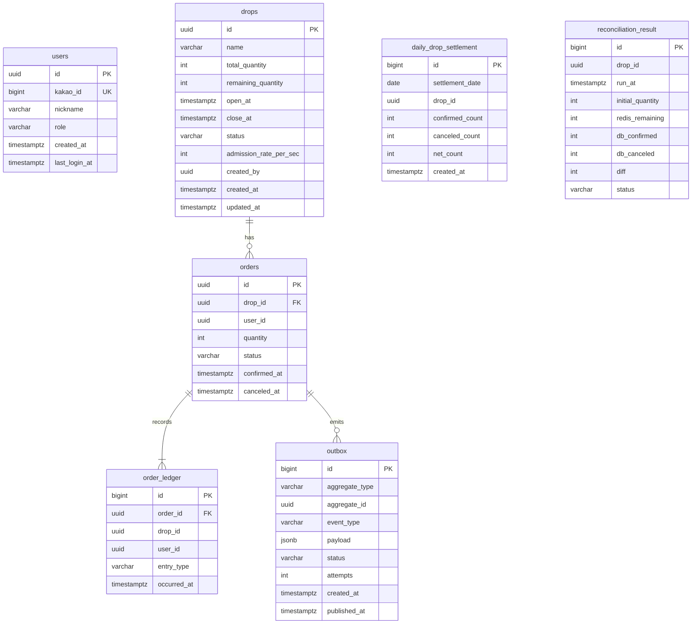

# 01 ERD (PostgreSQL)

인스턴스 하나, 스키마 셋. 서비스마다 DB 사용자를 두고 자기 스키마만 권한을 준다. settlement_user는 orders 스키마 SELECT만 추가로 받는다. 마이그레이션은 Flyway, 서비스마다 자기 스키마의 V 파일을 가진다.

식별자는 전부 UUID v7(시간 순 정렬, 인덱스 지역성). 시각은 전부 timestamptz, 저장은 UTC, 표시는 KST.

## 그림

users는 auth 스키마, drops와 orders와 order_ledger와 outbox는 orders 스키마, daily_drop_settlement와 reconciliation_result와 Spring Batch 메타 테이블은 settlement 스키마다. 스키마를 넘는 FK는 두지 않는다(orders.user_id는 users.id를 참조하지만 FK 없음, 경계 규칙).

## auth 스키마

### users

| 컬럼 | 타입 | 제약 | 뜻 |
|---|---|---|---|
| id | uuid | PK | UUID v7 |
| kakao_id | bigint | NOT NULL, UNIQUE | 카카오 사용자 ID |
| nickname | varchar(50) | NOT NULL | 카카오 프로필 닉네임, 없으면 "user" + 뒤 6자리 |
| role | varchar(20) | NOT NULL, CHECK (role IN ('USER','ADMIN')), DEFAULT 'USER' | 관리자는 시드로만 승격 |
| created_at | timestamptz | NOT NULL, DEFAULT now() | |
| last_login_at | timestamptz | NOT NULL, DEFAULT now() | 로그인마다 갱신 |

인덱스: PK, UNIQUE(kakao_id)만. 조회는 kakao_id와 id 둘뿐이다.

리프레시 토큰과 무효화 목록은 테이블이 아니라 Redis다(02 문서). JWT 서명 키는 K8s Secret에 PEM으로 두고 회전은 범위 밖이다(kid 하나).

## orders 스키마

### drops

| 컬럼 | 타입 | 제약 | 뜻 |
|---|---|---|---|
| id | uuid | PK | |
| name | varchar(100) | NOT NULL | |
| total_quantity | int | NOT NULL, CHECK (total_quantity > 0) | 초기 재고. OPEN 이후 변경 불가(트리거) |
| remaining_quantity | int | NOT NULL, CHECK (remaining_quantity BETWEEN 0 AND total_quantity) | 1주 차 DB만 경로의 재고. 2주 차부터 재고의 정본은 Redis고 이 컬럼은 DB 경로 플래그가 켜졌을 때만 갱신한다. 대조 배치는 이 컬럼이 아니라 orders 건수를 본다 |
| open_at | timestamptz | NOT NULL | |
| close_at | timestamptz | NOT NULL, CHECK (close_at > open_at) | |
| status | varchar(20) | NOT NULL, CHECK (status IN ('SCHEDULED','OPEN','SOLD_OUT','CLOSED')), DEFAULT 'SCHEDULED' | 상태 전이는 서비스가, 허용 전이는 트리거가 검사 |
| admission_rate_per_sec | int | NOT NULL, CHECK (BETWEEN 1 AND 10000), DEFAULT 50 | 초당 입장 인원 |
| created_by | uuid | NOT NULL | 관리자 user id, FK 없음 |
| created_at | timestamptz | NOT NULL, DEFAULT now() | |
| updated_at | timestamptz | NOT NULL, DEFAULT now() | 트리거로 갱신 |

허용 상태 전이: SCHEDULED -> OPEN, OPEN -> SOLD_OUT, OPEN -> CLOSED, SOLD_OUT -> CLOSED. 그 외는 트리거가 거절한다. total_quantity, open_at은 OPEN 이후 변경을 트리거가 거절한다.

인덱스: `drops_status_open_at_idx (status, open_at)`. 목록 조회가 status IN ('SCHEDULED','OPEN','SOLD_OUT') ORDER BY open_at이다.

### orders (현재 상태)

| 컬럼 | 타입 | 제약 | 뜻 |
|---|---|---|---|
| id | uuid | PK | |
| drop_id | uuid | NOT NULL, FK drops(id) | |
| user_id | uuid | NOT NULL | FK 없음 |
| quantity | int | NOT NULL, CHECK (quantity = 1) | 1인 1개 고정. 나중에 풀 때 CHECK만 바꾼다 |
| status | varchar(20) | NOT NULL, CHECK (status IN ('CONFIRMED','CANCELED')) | |
| confirmed_at | timestamptz | NOT NULL | |
| canceled_at | timestamptz | NULL, CHECK ((status = 'CANCELED') = (canceled_at IS NOT NULL)) | |

제약: `UNIQUE (drop_id, user_id)`. 1인 1회의 2차 방어이자 1주 차 DB만 경로의 1차 방어다. 취소한 사용자는 같은 드롭을 다시 살 수 없다(결정, 재구매 허용은 범위 밖).

트리거: UPDATE는 status CONFIRMED -> CANCELED와 canceled_at 설정만 허용, 그 외 컬럼 변경과 DELETE는 거절.

인덱스: `orders_user_confirmed_idx (user_id, confirmed_at DESC)` 내 주문 조회용. `orders_drop_status_idx (drop_id, status)` 대조 배치 집계용.

### order_ledger (불변 원장)

| 컬럼 | 타입 | 제약 | 뜻 |
|---|---|---|---|
| id | bigint | PK, GENERATED ALWAYS AS IDENTITY | |
| order_id | uuid | NOT NULL, FK orders(id) | |
| drop_id | uuid | NOT NULL | 결산이 orders를 조인하지 않게 중복 저장 |
| user_id | uuid | NOT NULL | |
| entry_type | varchar(20) | NOT NULL, CHECK (entry_type IN ('CONFIRMED','CANCELED')) | |
| occurred_at | timestamptz | NOT NULL, DEFAULT now() | |

트리거: UPDATE, DELETE, TRUNCATE 거절(미터엔진 V1과 같은 방식). 주문 확정과 취소는 같은 트랜잭션에서 orders 갱신 + order_ledger INSERT + outbox INSERT 셋을 함께 한다.

인덱스: `order_ledger_occurred_idx (occurred_at)` 일별 결산 범위 스캔용. `order_ledger_drop_occurred_idx (drop_id, occurred_at)` 드롭별 집계용. 합성 100만 건 뒤 EXPLAIN ANALYZE로 두 인덱스 전후를 기록한다.

### outbox

| 컬럼 | 타입 | 제약 | 뜻 |
|---|---|---|---|
| id | bigint | PK, IDENTITY | 이벤트 ID로도 쓴다(Streams 메시지의 event_id) |
| aggregate_type | varchar(30) | NOT NULL | 'order' |
| aggregate_id | uuid | NOT NULL | order id |
| event_type | varchar(50) | NOT NULL | 'order.confirmed', 'order.canceled' |
| payload | jsonb | NOT NULL | 04 문서 스키마 |
| status | varchar(20) | NOT NULL, CHECK (status IN ('PENDING','PUBLISHED','FAILED')), DEFAULT 'PENDING' | |
| attempts | int | NOT NULL, DEFAULT 0 | 10회 넘으면 FAILED |
| created_at | timestamptz | NOT NULL, DEFAULT now() | |
| published_at | timestamptz | NULL | |

인덱스: `outbox_pending_idx (created_at) WHERE status = 'PENDING'` 부분 인덱스. 릴레이는 `SELECT ... WHERE status = 'PENDING' ORDER BY created_at LIMIT 100 FOR UPDATE SKIP LOCKED`로 가져가서 파드가 여럿이어도 겹치지 않는다. PUBLISHED 행은 7일 뒤 삭제(결산 배치 뒤 스텝).

## settlement 스키마

### daily_drop_settlement

| 컬럼 | 타입 | 제약 |
|---|---|---|
| id | bigint | PK, IDENTITY |
| settlement_date | date | NOT NULL, KST 기준 날짜 |
| drop_id | uuid | NOT NULL |
| confirmed_count | int | NOT NULL, CHECK (>= 0) |
| canceled_count | int | NOT NULL, CHECK (>= 0) |
| net_count | int | NOT NULL, CHECK (net_count = confirmed_count - canceled_count) |
| created_at | timestamptz | NOT NULL, DEFAULT now() |

`UNIQUE (settlement_date, drop_id)`. 같은 날짜를 다시 돌리면 UPSERT가 아니라 삭제 뒤 재삽입(재시작 가능성 때문에 스텝 시작에 해당 날짜 행 삭제).

### reconciliation_result

| 컬럼 | 타입 | 제약 |
|---|---|---|
| id | bigint | PK, IDENTITY |
| drop_id | uuid | NOT NULL |
| run_at | timestamptz | NOT NULL, DEFAULT now() |
| initial_quantity | int | NOT NULL |
| redis_remaining | int | NULL, Redis를 못 읽으면 NULL |
| db_confirmed | int | NOT NULL |
| db_canceled | int | NOT NULL |
| diff | int | NULL, initial_quantity - redis_remaining - (db_confirmed - db_canceled). Redis를 못 읽으면 NULL |
| status | varchar(20) | NOT NULL, CHECK (status IN ('MATCH','MISMATCH','REDIS_UNAVAILABLE')), CHECK ((status = 'REDIS_UNAVAILABLE') = (diff IS NULL)), CHECK (status <> 'MATCH' OR diff = 0) |

인덱스: `reconciliation_drop_run_idx (drop_id, run_at DESC)`.

### Spring Batch 메타 테이블

BATCH_JOB_INSTANCE, BATCH_JOB_EXECUTION, BATCH_JOB_EXECUTION_PARAMS, BATCH_STEP_EXECUTION, BATCH_JOB_EXECUTION_CONTEXT, BATCH_STEP_EXECUTION_CONTEXT와 시퀀스. Spring Batch가 제공하는 PostgreSQL 스키마 SQL을 Flyway V1에 그대로 넣는다. 재시작 실험이 이 테이블에 기댄다.

## 트리거 목록

| 스키마.테이블 | 트리거 | 동작 |
|---|---|---|
| orders.drops | drops_guard_update | OPEN 이후 total_quantity, open_at 변경 거절. 허용되지 않은 status 전이 거절. updated_at 갱신 |
| orders.orders | orders_guard_update | CONFIRMED -> CANCELED 외 변경 거절 |
| orders.orders | orders_forbid_delete | DELETE 거절 |
| orders.order_ledger | ledger_immutable | UPDATE, DELETE, TRUNCATE 거절 |

제약과 트리거는 전부 SchemaConstraintTest로 고정한다(미터엔진 방식). 예상 테스트 수 12개.

## 합성 데이터

load/seed.kts 또는 SQL로 드롭 10개, 사용자 10만 명, order_ledger 100만 건(CONFIRMED 90만, CANCELED 10만)을 2026-09-01에서 09-30에 고르게 적재한다. 5주 차 배치 처리량과 인덱스 전후 측정에 쓴다.
